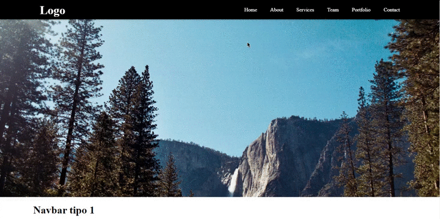
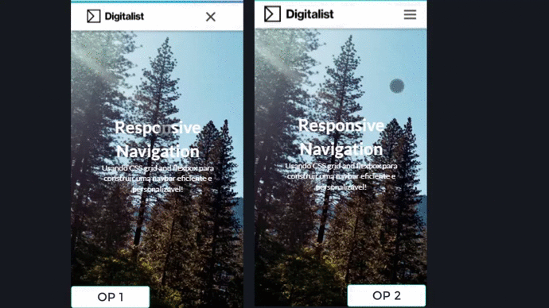
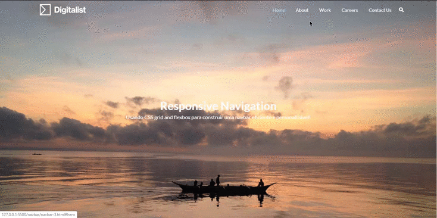

# Navbar

Desenvolvi com o intuito de ter um componente essencial mais prático durante a construção dos seus projetos, todas as navbars criadas são adaptaveis a proposta do layout que você estiver manejando. Estarei cada vez mais melhorando cada projeto de acordo com a minha evolução técnica. 

## <g-emoji class="g-emoji" alias="rocket" fallback-src="https://github.githubassets.com/images/icons/emoji/unicode/1f680.png">🚀</g-emoji>   Tecnologias 

Esse projeto foi desenvolvido com as seguintes tecnologias:

* HTML 5
* CSS (GRID ou FLEXBOX)
* JavaScript & JQuery

## <g-emoji class="g-emoji" alias="computer" fallback-src="https://github.githubassets.com/images/icons/emoji/unicode/1f4bb.png">💻</g-emoji> Projetos

## <a src= "./src/">Navbar 1</a>

É uma simples Navbar para modificações mais pessoais.

#### Desktop

</img>

#### Mobile

</img>

## <a src= "../src/">Navbar 2</a>

É uma navbar simples, mas com alguns recursos a mais:

* Gradient Bar, fica no topo da navbar, ela tem uma animação por causa dos Keyframes.

* Barra de pesquisa

* Tag Button

* Navbar Sidebar Mobile

* Navbar FullScreen Mobile

<a src= "./src/doc/navbar-2/README.md"><b>Mais detalhes</b></a>

#### Desktop

</img>

#### Mobile

</img>

## <a src= "../src/">Navbar 3</a>

A Navbar 3, é o tipo mais usado hoje em dia na construção de layouts. Veja as estilizações que podem ser adaptadas.

#### Desktop

</img>

#### Mobile

</img>

 

<g-emoji class="g-emoji" alias="rocket" fallback-src="https://github.githubassets.com/images/icons/emoji/unicode/1f680.png">🚀</g-emoji> Desenvolvido por <a src"https://github.com/merciakeila">Mércia Keila</a>