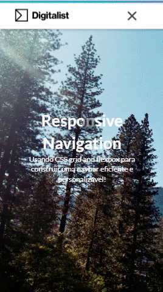
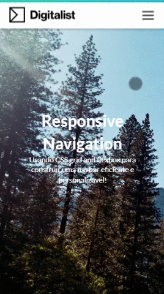

# NAVBAR 2

A Navbar 2, é uma simples navbar com alguns elementos e componentes que pode ser implentados em outros projetos também. Em breve versão Inglês.

</img>

Veja abaixo: 

* [Gradient Bar](#gradient-bar), fica no topo da navbar, ela tem uma animação por causa dos Keyframes.

* [Barra de pesquisa](#barra-de-pesquisa)
  
* [Tag Button](#Tag-Button)

* [Navbar Sidebar Mobile](#Navbar-Sidebar-Mobile)

* [Navbar FullScreen Mobile](#Navbar-FullScreen-Mobile)

## Vamos começar !

Esse documento é um passo a passo para implementar em seus projetos.

## Gradient Bar

1. Copie a tag e coloque no local que você que tenha o grandient bar.

```
<div class="grad-bar"></div>
```

2. Esse é o estilo e os kayframes para a animação. Copie os elementos abaixo e maniuple a seu gosto.

```
.grad-bar {
  width: 100%;
  height: 5px;
  background: linear-gradient(-45deg, #EE7752, #E73C7E, #23A6D5, #23D5AB);
  background-size: 400%;
  	-webkit-animation: gradbar 15s ease infinite;
	-moz-animation: gradbar 15s ease infinite;
	animation: gradbar 15s ease infinite;
}

@-webkit-keyframes gradbar {
	0% {
		background-position: 0% 50%
	}
	50% {
		background-position: 100% 50%
	}
	100% {
		background-position: 0% 50%
	}
}

@-moz-keyframes gradbar {
	0% {
		background-position: 0% 50%
	}
	50% {
		background-position: 100% 50%
	}
	100% {
		background-position: 0% 50%
	}
}

@keyframes gradbar {
	0% {
		background-position: 0% 50%
	}
	50% {
		background-position: 100% 50%
	}
	100% {
		background-position: 0% 50%
	}
}
```
<br>

## Barra de pesquisa

1. Copie a tag para ser adicionado na navbar dentro da `ul`.

```
<i class="fas fa-search" id="search-icon"></i>
<input class="search-input" type="text" placeholder="Pesquisar..">
```
2. Esses são os estilos da barra de pesquisa

### Desktop

```
#search-icon {
  font-size: 0.9rem;
  margin-top: 3px;
  margin-left: 10px;
  transition: color 0.3s ease-out;
}

#search-icon:hover {
  color: #3498db;
  cursor: pointer;
}

.search {
  transform: translate(-10%);
  -webkit-transform: translate(-10%);
  transition: transform 0.7s ease-in-out;
  color: #3498db;
}

.no-search {
  transform: translate(0);
  transition: transform 0.7s ease-in-out;
}

.search-input {
  position: absolute;
   right: -185px;
    opacity: 0;
    z-index: -1;
    transition: opacity 0.6s ease;
}

.search-active {
  opacity: 1;
}

input {
  border: 0;
  border-radius: 0; /* FOR SAFARI */
  outline: 0;
  padding: 5px;
}

```
### Mobile

```
@media only screen and (max-width: 720px) { 

#search-icon {
    display: none;
  }
  
  .search-input {
  display: none;
 }

}
```
<br>

## Tag Button

1. Copie a tag para ser adicionado na navbar dentro da `ul` a estrtura para criar um botão.

```
<div class="btn-primary"><a href="#" class="btn-custom">Button</a></div>
```
<br>


## Navbar Sidebar Mobile

</img>

1. A classe `container` mantém o limite a 90% que no caso forma esse efeito na `op 1`, caso prefira o `op 2`, adicione a tag `fluid` ao lado da classe `container`.

```
 <div class="container fluid">
    <nav class="navbar">
        <a href="#"></a> ...
```

1.1 Dentro do @media, será a manipulação das classes e estilos para mobile.
```
@media only screen and (max-width: 720px) { 
{
``` 
1. Na classe `nav.navbar ul`, dentro do @media, como padrão, o estilo para o sidebar.

```
nav.navbar ul {
    display: flex;
    flex-direction: column;
    position: fixed;
    justify-content: start;
    top: 55px;
    background-color: #fff;
    width: 100%;
    height: calc(100vh - 55px);
    transform: translate(101%);
    text-align: center; /* Posicionamento dos links (Esquerda, central ou direita) */
    overflow: hidden;
  }
```
4. Por causa do container, a brand (logotipo) fica com uma margem a frente, uma estilização padrão para desktop, recomendo que retire a margem para ficar mais alinhando no mobile, <b>é opcional</b>.
   
```
@media only screen and (max-width: 720px) { 

.brand {
    margin-left:0px;
}

{
```

## Navbar FullScreen Mobile

</img>

1. Adicione a tag `fluid` ao lado da classe `container`. <br>
O objetivo é ciar um container fluido com largura 100%.
```
 <div class="container fluid">
    <nav class="navbar">
        <a href="#"></a> ...
```
1.1 Dentro do @media, será a manipulação das classes e estilos para mobile.
```
@media only screen and (max-width: 720px) { 
{
``` 

2. Na classe `nav.navbar ul`, dentro do @media, já tem a estilização da [Navbar Sidebar Mobile](#Navbar-Sidebar-Mobile) como padrão, para deixar com o efeito fullscreen, vai ser necessário acrescentar os elementos abaixo para estilizar. 

```
nav.navbar ul {
        display: flex;
    flex-direction: column;
    position: absolute;
    justify-content: start;
    top: 0px;
    background-color: #fff;
    width: 100%;
    height: 100vh;
    transform: translate(101%);
    text-align: center;
    overflow: hidden;
}
```

3. Porém, tem um problema, o Menu Hambúrguer precisa sobrepor o background para poder fechar, nesse caso, adicione o estilo na classe abaixo.

```
.menu-toggle {
z-index: 999;
}
```
<br>
<hr>
<g-emoji class="g-emoji" alias="rocket" fallback-src="https://github.githubassets.com/images/icons/emoji/unicode/1f680.png">🚀</g-emoji> Desenvolvido por <a src"https://github.com/merciakeila">Mércia Keila</a>